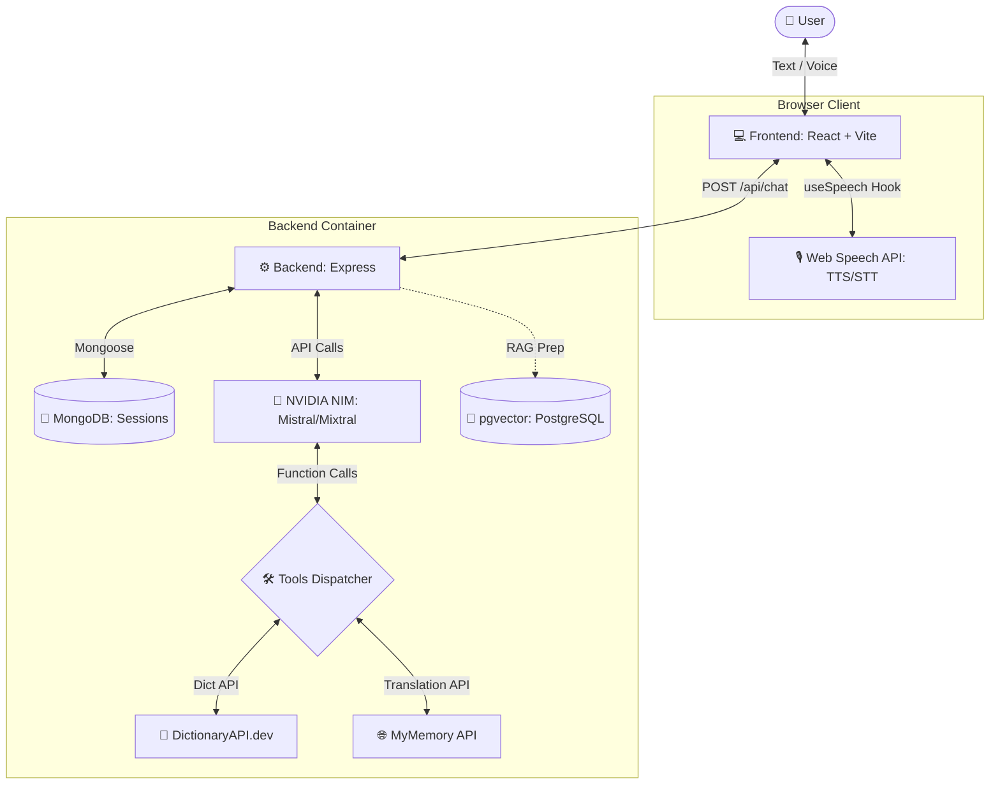

# 🎙️ VoiceAgent: Multimodal Conversational Web Application

Welcome to **VoiceAgent** (codename: **LinguaBot**), a modern and responsive web application designed for learning, practicing, and translating English and Spanish. This system integrates an intelligent AI agent with two-way voice capabilities (Speech-to-Text and Text-to-Speech) and real-time tool orchestration to deliver a seamless, fully conversational experience from start to finish.

This project is developed as part of the validation assessment for competencies in **Artificial Intelligence and Software Engineering** at **Riwi**.

---

## 📖 Table of Contents
1. [🌟 Key Features](#-key-features)
2. [🛠️ Tech Stack](#️-tech-stack)
3. [🧩 Architecture & Flow](#-architecture--flow)
4. [📂 Directory Structure](#-directory-structure)
5. [🔧 Agent Tools](#-agent-tools)
6. [🚀 Quickstart & Deployment](#-quickstart--deployment)
7. [💡 Use Cases & Manual Testing](#-use-cases--manual-testing)
8. [🧠 Agent System Prompt Rules](#-agent-system-prompt-rules)
9. [📆 MVP Development Timeline](#-mvp-development-timeline)

---

## 🌟 Key Features

*   **Hybrid Text/Voice Interaction (Native Multimodality):** Talk directly to the agent using your microphone, or type using standard text inputs. The agent responds both via readable text bubbles and synthesized voice narration.
*   **Intelligent Tool Orchestration (Function Calling):** When asked to translate a sentence or define a term, the agent dynamically invokes real-world APIs rather than hallucinating answers.
*   **Visual Tool Execution Badges:** The user interface explicitly signals when the agent is using a tool versus responding conversationally, rendering interactive badges that showcase the raw query details.
*   **Automatic Language Detection:** The agent automatically identifies whether the user is typing/speaking in English or Spanish and responds in the correct language with an encouraging tutor-like persona.
*   **Rolling Session Memory:** Leverages MongoDB database sessions to persist a sliding window of the last 7 messages, maintaining exact conversation context without unbounded context-window growth.
*   **Vector Search & RAG-Ready:** Includes a containerized `pgvector` database on PostgreSQL, fully prepared for expanding the application with web scraping and semantic document lookup.

---

## 🛠️ Tech Stack

The application is built using a containerized microservice design combined with client-side browser capabilities to maintain a high-performance, cost-free setup:

| Layer / Component | Technology | Rationale & Advantage |
| :--- | :--- | :--- |
| **Frontend** | React + Vite | Lightning-fast scaffolding, reactive components, and instant hot-reloads without framework overhead. |
| **Styling** | Vanilla CSS (CSS Variables) | Full control over the aesthetic layout, utilizing custom HSL color tokens, dark glassmorphic surfaces, and micro-animations. |
| **Backend** | Node.js + Express | Lightweight, high-throughput REST API server connecting the frontend to database endpoints and LLM controllers. |
| **AI Agent Core** | NVIDIA NIM (Mistral via OpenAI SDK) | Fast, free-tier access to industry-leading open-source models like `Mixtral-8x7B` or `Mistral-7B-Instruct`. |
| **Text-to-Speech (TTS)** | Browser `Web Speech API` (SpeechSynthesis) | Zero-cost, native browser narration that dynamically adjusts speech rate, pitch, and voice locales (en-US / es-ES). |
| **Speech-to-Text (STT)** | Browser `SpeechRecognition API` | Zero-cost client-side transcription with ultra-low latency. |
| **Database** | MongoDB | Agile, non-relational document database used to store session states and structured chat histories. |
| **Vector DB** | `pgvector` on PostgreSQL | Standard relational engine with vector extensions, set up to allow Retrieval-Augmented Generation (RAG) expansions. |
| **Containerization** | Docker + Docker Compose | Consolidates all four services (Frontend, Backend, MongoDB, Postgres) under a single command. |

---

## 🧩 Architecture & Flow

The system orchestrates client-side speech processing, REST handlers, databases, and LLM reasoning loops as illustrated below:



---

## 📂 Directory Structure

The project has a modular, clean folder tree that separates concerns across frontend and backend boundaries:

```text
voiceagent/
├── docker-compose.yml         # Container orchestration (frontend, backend, mongodb, postgres)
├── .env.example               # Root environment variables template
├── README.md                  # Main project guide (This file)
├── docs/
│   └── MVP.md                 # Concept design and timeline plans
│
├── backend/                   # Backend API Microservice
│   ├── Dockerfile             # Node environment setup
│   ├── package.json           # Backend dependencies (express, mongoose, openai, node-fetch)
│   └── src/
│       ├── index.js           # Server entry point & database initializer
│       ├── routes/
│       │   └── chat.js        # Main route (/api/chat) for handling conversations
│       ├── db/
│       │   └── memory.js      # Session memory handlers using MongoDB (keeps last 7 messages)
│       └── agent/
│           ├── agent.js       # Mistral agent core & multi-step function-calling loop
│           ├── tools.js       # Definitions and integrations for the REST API tools
│           └── prompt.js      # System prompt with strict instructions for the tutor persona
│
└── frontend/                  # React Client Microservice
    ├── Dockerfile             # Vite container config
    ├── package.json           # Frontend dependencies (react, react-dom, uuid, vite)
    ├── index.html             # Main index and Google Fonts loader (DM Sans & DM Serif)
    ├── vite.config.js         # Compiler configurations and routing proxies
    └── src/
        ├── main.jsx           # Renders React into DOM
        ├── styles/
        │   └── index.css      # Premium dark-theme token styling and global animations
        ├── hooks/
        │   └── useSpeech.js   # Reusable speech synthesis and recording controllers
        └── components/
            ├── ChatWindow.jsx    # Displays conversation bubbles, hints, and loading indicators
            ├── MessageBubble.jsx # Individual text rendering & orange tool-calling badges
            ├── InputBar.jsx      # Text input bar and micro-animated microphone recording trigger
            └── VoiceToggle.jsx   # Selectable switch for activating speech synthesis (TTS)
```

---

## 🔧 Agent Tools

To prevent conversational hallucination and provide precise definitions/translations, the agent leverages two zero-key, free REST tools:

### 1. `dictionary_lookup`
*   **Description:** Retrieves definitions, phonetics, grammatical parts of speech, and sentence examples for a word in English or Spanish.
*   **Service API:** [DictionaryAPI.dev](https://dictionaryapi.dev/) (native English, with es locale fallbacks).
*   **Parameters:** `word` (string), `language` (en/es).
*   **Returns:** Definition, phonetic string, word class, and sentence context.

### 2. `translate_and_analyze`
*   **Description:** Translates terms, colloquial phrases, or full sentences, scoring the resulting translation quality.
*   **Service API:** [MyMemory API](https://mymemory.translated.net/) (Free 1,000 requests/day).
*   **Parameters:** `text` (string), `source_language` (en/es), `target_language` (en/es).
*   **Returns:** Translated text, language mappings, and translation quality percentage (0-100).

---

## 🚀 Quickstart & Deployment

The application is fully containerized with Docker, making setup quick and reproducible on any system.

### Prerequisites
*   **Docker** and **Docker Compose** installed.
*   A free **NVIDIA NIM** API Key. Obtain yours at [NVIDIA Build](https://build.nvidia.com/).

### Step 1: Set Up Environment Variables
Duplicate the root environment template file:
```bash
cp env.example .env
```

Open the newly created `.env` file and insert your NVIDIA credentials:
```ini
# NVIDIA NIM (Mistral via OpenAI-compatible API)
NVIDIA_API_KEY=nvapi-your-secret-key-here
NVIDIA_BASE_URL=https://integrate.api.nvidia.com/v1
NVIDIA_MODEL=mistralai/mixtral-8x7b-instruct-v0.1

# MongoDB
MONGO_URI=mongodb://mongodb:27017/voiceagent

# PostgreSQL (pgvector) — used for RAG
POSTGRES_HOST=postgres
POSTGRES_PORT=5432
POSTGRES_DB=voiceagent
POSTGRES_USER=postgres
POSTGRES_PASSWORD=postgres

# Server
PORT=3001
```

> [!IMPORTANT]
> The backend container references the environment settings in the root `.env` directory during the Docker build stage. Make sure you customize the file located in the root of `ai_assesment_test_2`.

### Step 2: Build & Start Containers
Launch all services using Docker Compose:
```bash
docker compose up --build
```
This builds and hooks together MongoDB, Postgres with pgvector, the Node.js Express server, and the Vite compilation server. All databases automatically provision storage volumes to ensure persistence when stopping containers.

### Step 3: Run the Web App
Once the startup logs confirm backend readiness (`✅ MongoDB connected` and `✅ Backend running on port 3001`), point your web browser to:

*   **Web Dashboard (Frontend):** [http://localhost:5173](http://localhost:5173)
*   **REST Server (Backend):** [http://localhost:3001](http://localhost:3001)
*   **Health Status Route:** [http://localhost:3001/api/health](http://localhost:3001/api/health)

---

## 💡 Use Cases & Manual Testing

To confirm the agent operates as intended, test it with the following dialog flows:

### Test Case A: Chit-Chat & Greeting (Conversational Flow)
*   **User Input:** `"Hi! I want to practice my Spanish today. How are you?"`
*   **Expected Behavior:** The agent detects English, replies naturally in English, welcomes you to practice, and sets up a warm, tutoring tone. **No tools are executed** since it's standard conversational dialogue.

### Test Case B: Vocabulary Definition (Tool 1)
*   **User Input:** `"Can you tell me the definition of the word 'ephemeral' in English?"`
*   **Expected Behavior:** The agent recognizes a vocabulary query. It triggers `dictionary_lookup`, performs the API search, renders an orange badge displaying `Tool used: Dictionary Lookup` on the screen, and summarizes the returned meaning in 2-3 pedagogical sentences.

### Test Case C: Idiom Translation & Context (Tool 2)
*   **User Input:** `"Traduce esta frase al español por favor: 'The early bird catches the worm'"`
*   **Expected Behavior:** The agent detects a request to translate a complex phrase. It triggers `translate_and_analyze`, translates it, outputs the visual badge `Tool used: Translate & Analyze`, and provides a warm explanation matching it to its colloquial Spanish equivalent (*"A quien madruga, Dios le ayuda"*).

### Test Case D: Domain Out-of-Scope Redirection
*   **User Input:** `"What is the stock price of Apple right now?"`
*   **Expected Behavior:** The agent identifies that financial data is unrelated to language tutoring. It politely declines the query and suggests returning to grammar, culture, or translation practice.

---

## 🧠 Agent System Prompt Rules

To maintain high levels of pedagogical consistency, `backend/src/agent/prompt.js` implements 7 foundational rules:

1.  **ROLE:** Act exclusively as a helpful and encouraging bilingual English-Spanish language tutor.
2.  **TONE:** Warm, celebratory, and instructive. Never dry or condescending.
3.  **TOOL USE:** Call backend tools *only* when translating phrases or defining specific vocab words. Use general conversational knowledge for everything else.
4.  **RESTRICTIONS:** Politely redirect any conversations that fall outside the realms of grammar, vocabulary, culture, and language practice.
5.  **CONCISENESS:** Keep responses to a maximum of 3 sentences (unless detailed layouts are explicitly requested), keeping the learning experience fast-paced.
6.  **LANGUAGE REFLECTION:** Mirror the user's selected language by default.
7.  **CONTEXT RETRIEVAL:** Proactively refer to prior vocabulary or questions in the session to solidify memory and learning.

---

## 📆 MVP Development Timeline

This MVP implementation plan is structured as a 6-hour sprint:

*   **Block 1 (0:00–0:45) - Foundation:** Establish Docker Compose scripts, install basic backend routes, and verify `/api/health` queries.
*   **Block 2 (0:45–1:45) - Intelligence Core:** Connect OpenAI SDK with NVIDIA NIM endpoints, and initialize the Mongoose MongoDB connection with a 7-message rolling memory.
*   **Block 3 (1:45–2:45) - Integration of Tools:** Implement `dictionary_lookup` and `translate_and_analyze` routines, routing their outputs into the agent's function-calling loop.
*   **Block 4 (2:45–3:45) - Graphic Interface:** Build the React chat page, scroll features, message bubbles, and diagnostic badge systems.
*   **Block 5 (3:45–4:30) - Voice Controls:** Wire the `useSpeech.js` hook to capture microphones (STT) and output voice narrations (TTS).
*   **Block 6 (4:30–6:00) - Fine-Tuning:** Review styling rules, verify contrast levels, polish animation timings, and finalize documentation files.

---

*Authored with dedication for the Riwi Validation Exam by Santiago Sánchez Ruiz.*
