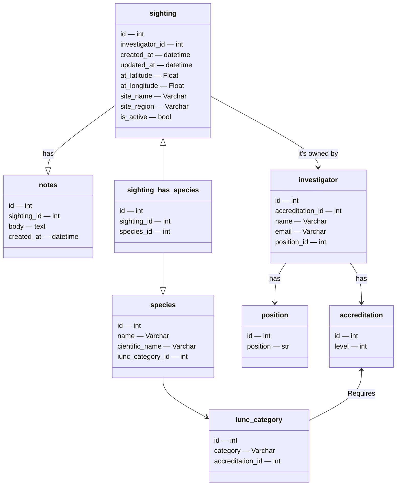
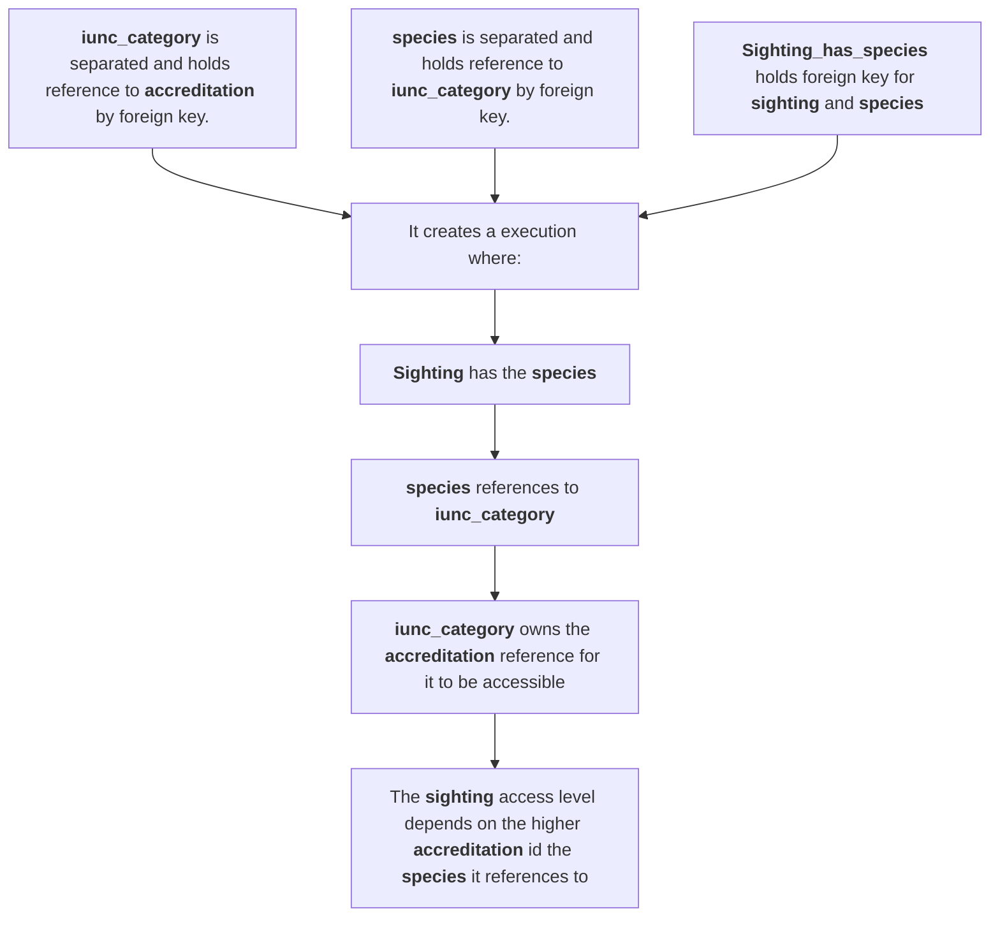
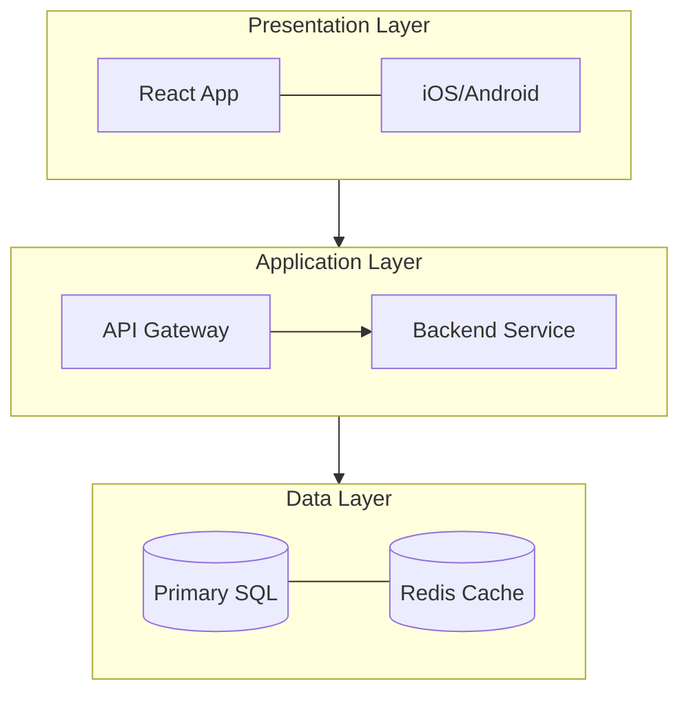

# Initial architecture proposal
This is the original planned architecture (No AI involved) for the project:

## Requirements
The following are the tech stack that will be implemented to comply to the technical requirements

### Analysis, normalization and data modeling
The [seed.json](./../../seed.json) file has the following (consistent) properties:

```json
    "obs_ref": str,
    "investigador_nombre": str,
    "investigador_email": str,
    "investigador_cargo": str,
    "investigador_acreditacion": int,
    "especie_comun": str,
    "especie_cientifica": str,
    "categoria_iucn": Enum<str>,
    "sitio_nombre": str,
    "sitio_region": str,
    "latitud_exacta": float,
    "longitud_exacta": float,
    "clasificacion": str,
    "notas_campo": str,
    "registrado_en": datetime,
    "editado_en": datetime,
    "anulado": bool
```

The objects/entities that can be identified and separated are:  

`investigator` *(Investigador)* → The person that is creating the register.  

`specie` *(Especie)* → The animal species, including the common name and the cientific one.  

`site` *(sitio)* → The place where the animal, or group of animals, was encountered.  

`clasification` *(Clasificacion)* → The access level security.  

`sighting` (Avistamiento) → The main object around which everything is related, it includes notes and the date time.  

There are some entities that could be beneficial to separate:  

`investigator position` → `position`: Since there could be any new position, and the position can be an Enum, a single small table that holds the positions and the positions ID's is trivial and allows future update easily. It also would allow faster query using positions. 

`iunc category`: Should be its own separate entity, since is a third party convention and therefore can be changed at any given moment. It allows for fast update.

`sighting notes`: Since the assignment mentions that the registers can be updated, the body could be a separate entity to allow versioning, allowing a sighting to have multiple notes versions. Filter to show only the most recent on default would be trivial. **Possible problem?** Bad performance on constantly growing sighting registers.

#### Diagram


**Why the before diagram?**


Position is a separated entity → Positions are kept consistent across all investigators, allows creating new positions without assigning an investigator to it.  
Position doesn't have accreditation due to: Same position investigators can have special privileges in a company. That's why the accreditation level is assigned to the investigator.

Notes → Include created at to filter by. (Maybe consider that the coordinates may also change due to migration, but then, would they be from the same sighting event? Consider creating entities for species groups)

Classification → It appears in the JSON but was removed from the ERD since classification should be derived from the `iunc_category` rather than human manual classification on the sighting, human can mistakenly assign a public classification to an endangered species.

Species → The JSON didn't include it, but consider adding information: Amount of said species spotted, females and males ratio, and young amount. (This is vital information to know in a case like the assignment presents)

### PostgreSQL
Create [Docker image](https://hub.docker.com/_/postgres) with:
```yaml
# Use postgres/example user/password credentials
services:
  db:
    image: postgres
    restart: always
    # set shared memory limit when using docker compose
    shm_size: 128mb
    # or set shared memory limit when deploy via swarm stack
    #volumes:
    #  - type: tmpfs
    #    target: /dev/shm
    #    tmpfs:
    #      size: 134217728 # 128*2^20 bytes = 128Mb
    environment:
      POSTGRES_PASSWORD: example

  adminer:
    image: adminer
    restart: always
    ports:
      - 8080:8080
```
And add support for [pgvector](https://github.com/pgvector/pgvector#docker) using Dockerfile:
```bash
    docker pull pgvector/pgvector:pg18-trixie
```
Alternatively, use a docker [hardened image for pgvector](https://hub.docker.com/hardened-images/catalog/dhi/pgvector/guides):
```yaml
services:
  db:
    image: dhi.io/pgvector:pg18
    environment:
      POSTGRES_PASSWORD: mysecretpassword
    volumes:
      - pgvector-data:/var/lib/postgresql
    ports:
      - "5432:5432"

volumes:
  pgvector-data:
```

### Business logic in database
Using PostgreSQL built-in functions and transactions:
```SQL
CREATE OR REPLACE FUNCTION function1(
    param int,
    param str
) RETURNS VOID AS $$
BEGIN
    UPDATE something
    SET this = that
    WHERE here = some

    UPDATE another
    SET one = more
    WHERE its = there
END;
$$ LANGUAGE plpgsql;

-- use
BEGIN;
SELECT funtion1(1, "number");
COMMIT;
```

Or using PostgreSQL procedures:

```SQL
CREATE OR REPLACE PROCEDURE a_procedure()
LANGUAGE plpgsql
AS $$
BEGIN
    -- Transaction block
    BEGIN
        INSERT INTO thing (value1, value2) VALUES ('new value', 'new value')
        COMMIT;
    END;

    BEGIN
        INSERT INTO otherthing (value2, value3) VALUES ('new value', 'new value')
        COMMIT;
    END;
END;
$$;
-- Usage
CALL a_procedure();
```

Both can be used, procedures do not return values, functions do. 

### Search, context retrieval and security
Since the data needs a specific access level to be retrieved:
- A mirror database with the same information as the database but vectorized would allow prompt injections attacks to retrieve confidential information, no matter the harness.
- A mirror vector database from the database will mean double the queries and performance time for every operation → Create a sighting, it needs to go both into the normal database and the vector database

So, a mirror database is discarded for the before reasons, instead:
- Create a materialized view using the investigator level access and vectorizing the information.
- The only information the AI would ever reach would depend solely on the backend system, therefore, any breach to the confidential information can be traced back to only one cause.
- Performance wouldn't be as compromised, the materialized view would only need to be updated when the AI Agent is used, not in real time.

The vectorized information would exist as a single table with all the required information per sighting. 
To reduce complexity, a chunk in the database would correspond to a whole sighting information. 
This means that the chunks would be arbitrarily big or small, and the more updates the notes on sighting has, the more would the chunk grow
- To work around the note's context bloating, the main table holds only the last note version, and there exists another table where the multiple notes body exist.  

### Backend and REST API
