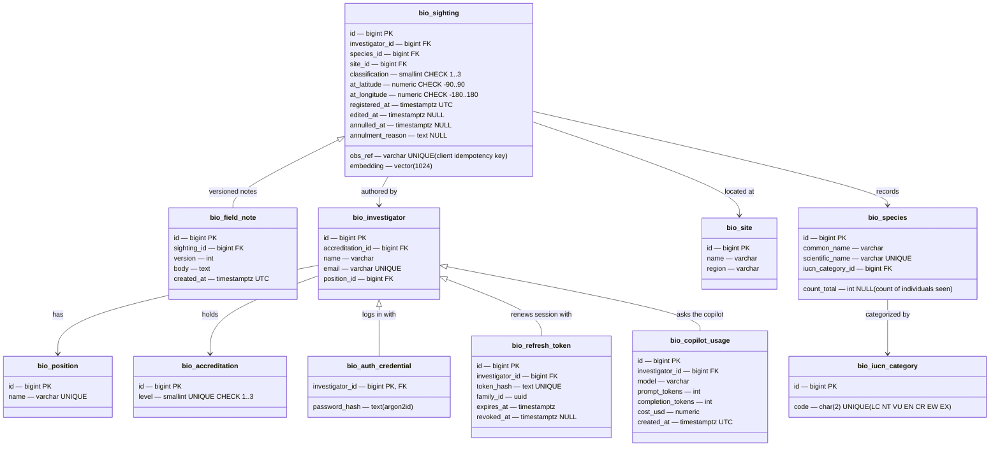
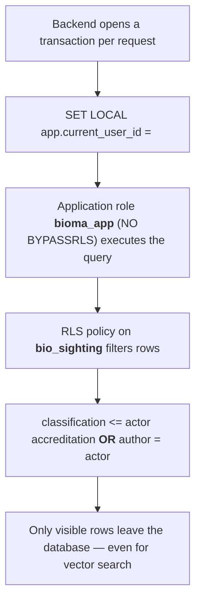
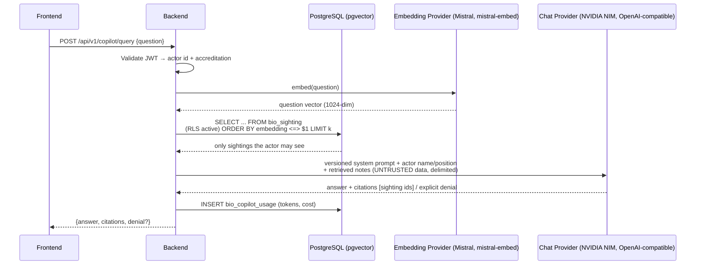
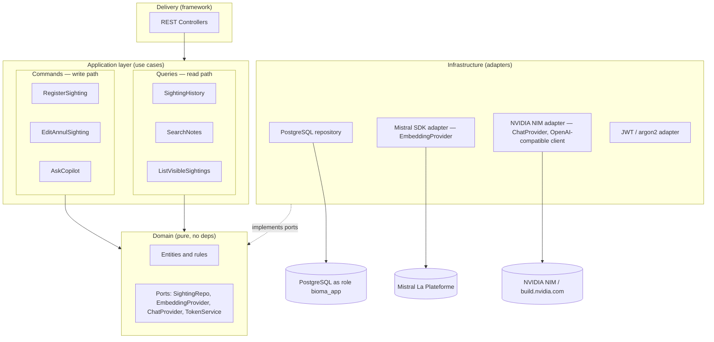
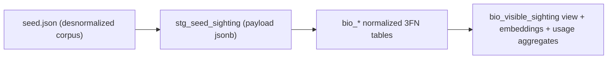

# Bioma — Platform Architecture

Authoritative architecture document for the **Bioma** platform (Fundación Yarumo wildlife monitoring, integrator project). The discussion history and original human planning draft are preserved in git history (`docs/ADR/INITIAL_ARCHITECTURE.md`); this document reflects the final decisions.

---

## 1. Goals and guiding principles

The central problem is **information security**: exact locations of threatened species must never leak below an investigator's accreditation level — not by direct query, not by search, not through the AI copilot.

Principles, in order of importance:

1. **The database is the single security boundary.** The visibility rule `classification <= accreditation OR author = actor` is enforced by PostgreSQL Row Level Security. The backend, the seed script, and even a DBA with `psql` obey the same policy. There is exactly one place to audit.
2. **Critical logic lives in the database** (transactions, constraints, RLS, functions, procedures, triggers). The backend is a thin dispatcher.
3. **No mirror stores.** Vectors live inside the RLS-protected table, so vector search is filtered by the same policy automatically.
4. **Thin use cases, inward-pointing dependencies** (Clean Architecture). The domain does not know the web framework or the DB driver; the two hardest things to swap later (framework, AI provider) are behind ports.
5. **YAGNI where the brief allows it.** No message bus, no event sourcing, no ETL platform — one static corpus, one monolith, one compose file.

---

## 2. Domain model (normalized to 3FN)

### 2.1 From the seed to entities

The desnormalized corpus (`docs/seed.json`) repeats investigators, species and sites across rows — the "before" evidence for normalization is preserved in the Bronze staging table (§9). Entities identified:

| Entity | Rationale |
|---|---|
| `sighting` | Aggregate root: the observable event, with classification, coordinates, dates, annulment |
| `field_note` | Versioned note bodies; science never deletes evidence, each edit creates a new version |
| `species` | Common + scientific name, IUCN category FK, count of individuals |
| `iucn_category` | Third-party code (LC/NT/VU/EN/CR/EW/EX); mutable policy, isolated |
| `site` | Name + region; heavily repeated in the corpus, needed for §11.1 query |
| `investigator` | Person + accreditation + position |
| `position` | Independent enum table: positions exist without investigators |
| `accreditation` | Ordinal levels 1–3 (public / restricted / confidential) |
| `auth_credential`, `refresh_token` | Login state, separated from the business person |
| `copilot_usage` | Token/cost audit per request for §11.4 |

### 2.2 Naming and conventions (requirement §2)

- Database name: `bioma_<nombre>_<apellido>`.
- All tables and columns in **English**, prefixed with **`bio_`**.
- All dates as **`timestamptz` in UTC**, `DEFAULT now()`.
- Annulment is **logical only**: `annulled_at` + `annulment_reason` (a `CHECK` enforces they appear together). Physical `DELETE` is revoked from the application role.

### 2.3 Entity–relationship diagram



### 2.4 Keys and indexes

- **Surrogate keys** (`bigint` identity) everywhere. **Justification:** `obs_ref` from the legacy export is a natural-key candidate, but natural keys from external systems change format without warning; it is kept as a `UNIQUE` business key that doubles as the **idempotency key** for registration. Composite natural keys would leak multi-column FKs into every child table (e.g. `bio_field_note`) and complicate the edit/annul procedures.
- **Required partial unique index** — an investigator cannot register the same species at the same site on the same UTC day twice while the record is active:

```sql
CREATE UNIQUE INDEX uq_bio_sighting_active_daily
ON bio_sighting (investigator_id, species_id, site_id, (registered_at AT TIME ZONE 'UTC')::date)
WHERE annulled_at IS NULL;
```

- Vector index on `bio_sighting.embedding` (HNSW) for copilot retrieval; regular composite index `(registered_at, id)` backing keyset pagination.

### 2.5 Design decisions on controversial points

- **`classification` lives on the sighting**, not derived from IUCN. Deriving it would silently change access permissions whenever a third party re-categorizes a species. IUCN may *suggest* a default inside the register function; the stored value is the security attribute.
- **One species per sighting** (direct FK, no join table): the corpus is strictly 1:1 and the partial unique index cannot span a join table. Multi-species events are separate sightings.
- **Accreditation belongs to the investigator**, not to the position or the IUCN category: same-position colleagues may hold different clearance.

---

## 3. Security architecture — Row Level Security (§3)



```sql
CREATE POLICY bio_sighting_visibility ON bio_sighting
USING (
    classification <= (
        SELECT a.level
        FROM bio_investigator i
        JOIN bio_accreditation a ON a.id = i.accreditation_id
        WHERE i.id = current_setting('app.current_user_id')::bigint
    )
    OR investigator_id = current_setting('app.current_user_id')::bigint
);

-- View required by §3, encapsulates the rule + logical-annulment filter:
CREATE VIEW bio_visible_sighting AS SELECT * FROM bio_sighting WHERE annulled_at IS NULL;
```

Transactional logic in the database:

| Object | Type | Purpose |
|---|---|---|
| `bio_register_sighting(...)` | Function | Validates input + accreditation, inserts sighting and first note version in one transaction — all-or-nothing. Suggests classification from IUCN. |
| `bio_search_investigators(...)` | Procedure | Researcher lookup (required §3 procedure #1). |
| `bio_edit_or_annul_sighting(...)` | Procedure | Edit appends a new field-note version and bumps `edited_at`; annulment sets `annulled_at` + reason. Never physical delete (required §3 procedure #2). |
| Trigger `trg_sighting_embedding` | Trigger | `AFTER INSERT` on `bio_field_note` / sighting insert → recompute `bio_sighting.embedding` from the latest note body. |

---

## 4. Vector search and the AI copilot — RAG (§4, §8)

### 4.1 Retrieval pipeline



> **Two providers, two ports.** `EmbeddingProvider` and `ChatProvider` (§5.2) are separate interfaces on purpose — embeddings are pinned to Mistral (`mistral-embed`, 1024 dims) and chat is pinned to NVIDIA's NIM catalog (OpenAI-compatible endpoint), a project constraint rather than a technical one. Each is still injected via its own port, so either can be swapped later without touching use-case code.

### 4.2 Key decisions

- **One chunk = one sighting** (latest field-note version). Note versioning prevents unbounded chunk growth; the trigger keeps vector and content in lockstep.
- **No mirror vector database.** The embedding lives in the RLS-protected row, so similarity search is permission-filtered for free, with nothing to synchronize and nothing to leak.
- **Interchangeable provider**: the backend defines separate `EmbeddingProvider` (→ Mistral SDK) and `ChatProvider` (→ NVIDIA NIM via an OpenAI-compatible client) ports; either can be re-pointed to a different vendor or model string as configuration, not code, since both are OpenAI-compatible or thin SDK wrappers behind the port.
- **System prompt versioned** (constant in the repo, logged per request); field notes are wrapped in explicit delimiters and labelled untrusted inside the prompt.
- **Explicit denial taxonomy**: (a) *no accreditation* — refuse with transparency, never approximate a location; (b) *out of scope* — off-topic refused; (c) *insufficient context* — honest "the visible history does not contain that". Every answer carries **citations to source sighting ids**.
- **Consumption audit (§11.4)**: one insert per call into `bio_copilot_usage`; the accumulated report is a `GROUP BY investigator_id`.
- **Lexical search with highlight (§11.2)**: `ts_headline('spanish', body, plainto_tsquery('spanish', $1))` over `bio_field_note`, under the same RLS policy.

---

## 5. Backend architecture (§5)

### 5.1 CQRS — what it is and how it applies

**CQRS (Command Query Responsibility Segregation)** separates operations that *change* state (commands: register, edit, annul) from operations that *read* state (queries: history, search, copilot context). Full CQRS with two stores and event sourcing is deliberately **rejected** as overkill. Applied pragmatically: one database, but the write path goes exclusively through the transactional DB functions/procedures while the read path goes through the visible view and keyset queries. This is exactly the brief's "thin use cases": use cases contain no business rules — they validate input, dispatch to one side, and map results.

### 5.2 Clean Architecture layers



Only design pattern deliberately applied: **Dependency Injection via constructor-provided ports** (SOLID's D, demonstrable). No Service Locator, no Event Bus — nothing in the brief justifies them.

---

## 6. API contract — REST conventions (§5, §11)

An API **contract** is the explicit agreement between client and server: URLs, methods, status codes, headers, payload shapes — published contract-first as **OpenAPI 3.x (Swagger UI)** docs.

- **Resources are nouns, actions via HTTP verbs**, everything under `/api/v1`; a breaking change ships as `/api/v2` without breaking the shipped app.
- **Status codes:** `200` reads · `201` registration · `204` annulment · `400` validation · `401` missing/invalid token · missing-or-invisible sightings return **`404`, never `403`** — `403` would leak that a sighting exists, which is itself confidential.
- **Uniform errors:** RFC 9457 `application/problem+json` envelope everywhere.
- **Correlation ID:** every request gets/accepts `X-Request-Id`, echoed in responses, error bodies and backend logs — a user report maps to exactly one trace.
- **Keyset pagination, never `OFFSET`**: the last-seen row identity is the cursor.

```sql
SELECT ... FROM bio_sighting
WHERE (registered_at, id) < ($1::timestamptz, $2::bigint)
ORDER BY registered_at DESC, id DESC
LIMIT $3;
```

Response shape: `{ "items": [...], "next_cursor": {"registered_at": ..., "id": ...}, "has_more": bool }`. `OFFSET` scans and discards N rows per page and skips/repeats rows when the list mutates between pages — keyset is stable under real-time registration.

- **Idempotent registration:** the client-generated `obs_ref` is `UNIQUE`; retrying a submission returns `409` (or the original record) instead of a duplicate — this backs the frontend's *pending → sent → failed* state machine.
- **Forbidden (invalidating conditions):** physical deletes, SQL string concatenation (everything parameterized), `OFFSET`.

### Endpoint surface

| Method & path | Purpose |
|---|---|
| `POST /api/v1/auth/login` · `POST /auth/refresh` | Sessions (JWT + rotation) |
| `GET /api/v1/sightings?cursor&limit&species_id&site_id` | Visible history, keyset (§11.1) |
| `POST /api/v1/sightings` | Register (transactional function) |
| `PATCH /api/v1/sightings/{id}` · `POST /sightings/{id}/annul` | Edit / logical annul (procedure) |
| `GET /api/v1/me` · `GET /api/v1/investigators?cursor` | Profile / researcher lookup (§3 procedure) |
| `GET /api/v1/sightings/search?q=` | Notes search with `ts_headline` highlight (§11.2) |
| `POST /api/v1/copilot/query` | RAG answer + citations (§11.3) |
| `GET /api/v1/copilot/usage` | Accumulated consumption per researcher (§11.4) |

---

## 7. Authentication and authorization (§6)

- Passwords hashed with **argon2id** (bcrypt acceptable) in `bio_auth_credential`. Plaintext passwords invalidate the project.
- **Access JWT**, short-lived (~15 min), carrying `sub = investigator_id`. Accreditation is resolved from the database per transaction, not trusted from the claim — tokens are stateless and a clearance promotion must not wait for token expiry.
- **Refresh token rotation**: each refresh issues a new pair and revokes the previous one; tokens stored **hashed** in `bio_refresh_token` with a `family_id`; presenting an already-revoked token revokes the whole family (reuse/theft detection).
- **Actor propagation**: middleware extracts `sub` → opens the transaction → `SET LOCAL app.current_user_id` → the whole request (including RAG retrieval) executes as that actor. Identity is never taken from the request body.

---

## 8. Frontend architecture (§7)

- **Three required zones:** map/list of sightings · copilot panel · investigator profile.
- **Registration state machine** *pending → sent → failed* built around the idempotent `obs_ref`; retries are safe by contract.
- **Lazy history**: `IntersectionObserver` triggers the next keyset fetch; the list never remounts (scroll position preserved); explicit *loading / empty / error* states.
- **i18n**: ICU message files (`es.json`, `en.json`); zero strings inside components; responsive mobile + desktop.
- **Location obfuscation decision**: unauthorized sightings are **never returned by the API**, so the UI never renders them instead of rendering blurred markers. Justification: obfuscation still ships coordinates to the client — one wrong rounding choice and an endangered species is exposed. Server-side exclusion is the only airtight option.

---

## 9. Data engineering — medallion structure and ETL (§1, §10)

**Medallion** layering: **Bronze** stores data as received (auditable, immutable) → **Silver** is the cleaned/normalized 3FN model → **Gold** is consumption-oriented read structures.



Even for a one-shot load, Bronze keeps the corpus exactly as delivered — the "before" data for the 1FN→3FN write-up — and makes the Silver load re-runnable.

**ETL tools considered:** Apache Airflow (orchestration), dbt (SQL transforms), Talend Open Studio and Pentaho Data Integration/Kettle (visual ETL), Azure Data Factory and AWS Glue (managed), Airbyte/Fivetran (connectors). **Chosen: none** — a single Python script (`psycopg`, parameterized inserts, never concatenation) as a disposable `seed` compose service. The corpus is one static JSON file; an ETL platform adds containers and credentials without buying repeatability that `docker compose run seed` doesn't already give.

---

## 10. Quality assurance — BDD (§9)

**BDD (Behavior-Driven Development)** writes tests in business language — *Given / When / Then* (Gherkin) — so the scenario itself is readable proof that the security rule works. The two mandatory tests as executable specifications:

```gherkin
Feature: Visible sightings by accreditation
  Scenario: Low accreditation cannot see others' confidential sightings
    Given investigator "Valentina" with accreditation 1
    And a confidential sighting authored by "Camila"
    When Valentina requests the sighting history, a notes search, or asks the copilot
    Then the confidential sighting does not appear in any of the three channels

  Scenario: An author always sees their own sightings
    Given investigator "Valentina" with accreditation 1
    And a confidential sighting authored by Valentina herself
    When Valentina requests the sighting history
    Then her sighting is present despite exceeding her accreditation
```

Executed with **pytest + pytest-bdd** against a **real PostgreSQL spawned by testcontainers**; each scenario sets `app.current_user_id` per actor, mirroring the manual `psql` verification the brief recommends doing first.

---

## 11. Deployment and infrastructure (§10)

Two separate concerns, two separate topologies: **local/graded environment** (must boot from `docker compose up` alone, per the brief) and **production environment** (now built around a $0 budget — see §11.1).

```yaml
services:
  db:        # pgvector/pgvector:pg18 (PostgreSQL 18 + pgvector 0.8.x) with healthcheck
  migrate:   # applies DDL/functions/RLS once (depends_on db healthy, restart: "no")
  seed:      # medallion load: bronze -> silver (restart: "no")
  backend:   # API, depends_on migrate completed_successfully
  frontend:  # static build served by nginx
```

- `docker compose up` brings up **db + backend + frontend**.
- One documented command applies migrations and loads the full corpus: `docker compose run migrate && docker compose run seed`.
- `.env.example` ships with placeholders only — no real secrets. The project must boot on a clean machine from the README alone.
- This local stack is unchanged in shape from the original proposal; only the Postgres image tag moves from `pg15` to `pg18` (§12).

### 11.1 Production topology on a $0 budget

The original VPS + Caddy plan assumed a small recurring spend. With a hard $0 budget, it is replaced by three free managed services instead of one paid box — each with a real (not trial) free tier as of 2026:

| Concern | Service | Why this one | Caveat to design around |
|---|---|---|---|
| Database | **Neon** (Supabase as equal alternative) | Real, unmodified PostgreSQL with a **permanent** free tier (no card, no expiry) — full support for custom roles, `CREATE POLICY`, `SET LOCAL`, functions/procedures/triggers, and pgvector. Nothing in §3's RLS design has to change. | Free tier is single-region, shared compute, ~0.5–3 GB storage — comfortably enough for one static corpus. Use the **pooled** connection string in **transaction mode**, and keep `SET LOCAL app.current_user_id` inside the same transaction as the query it protects (it already is, per §7) so pooling never separates the two. |
| Backend (API) | **Render** free Web Service, deployed from the same backend `Dockerfile` | No card required; gives a real HTTPS URL with zero reverse-proxy config, replacing Caddy entirely. | Free web services spin down after 15 min idle and cold-start in ~30–60s on the next request — acceptable for an academic/demo audience; mitigate with a free uptime pinger if a live grading session needs to avoid the cold start. |
| Frontend | **Render Static Site** (Vercel/Netlify are equally valid) | Static hosting has no spin-down and is free indefinitely. | None of note. |
| Migrate / seed | Same `migrate` and `seed` containers, run **once** with `--env-file .env.prod` pointed at the Neon/Supabase connection string | They only need a Postgres URL — no code changes between "local Postgres in Compose" and "remote Postgres on Neon." | Run this from a dev machine or a Render one-off Job; there is no scheduler dependency since the corpus is static (§9). |
| Backups | Neon's/Supabase's built-in point-in-time recovery on the free tier (shorter retention than a paid tier) | Zero extra cost vs. the original nightly `pg_dump` cron | For anything beyond course-project stakes, a scripted `pg_dump` to object storage is still the more durable answer — kept as the fallback below. |

**Fallback:** if a small budget ever does appear, the original single-VPS + Docker Compose + Caddy plan (with nightly `pg_dump`) is still the better production shape — it removes the cold-start trade-off and the multi-vendor moving parts. Treat §11.1 as the $0 default and the VPS plan as the upgrade path, not the other way around.

---

## 12. Technology stack

| Layer | Proposed | Rationale | Fallback |
|---|---|---|---|
| Language | **Python 3.13** | One clear step up from 3.12 with a fully-settled ecosystem (FastAPI, Pydantic v2, psycopg 3, testcontainers all first-class). Python 3.14 is out, but its free-threading/deferred-annotation changes are still being validated across third-party packages — not worth the risk for a graded project. | TypeScript (Node 24 LTS) / Java 21 if that's the known stack |
| Backend framework | **FastAPI** (current 0.12x line) | Unchanged: auto-generated OpenAPI 3.x docs, async, DI built-in | NestJS / Spring Boot |
| DB driver | **psycopg 3** (3.2.x, no ORM for business paths) | Unchanged: the brief demands SQL-first; an ORM would hide the functions/RLS that carry the points | SQLAlchemy Core for reads only |
| Database | **PostgreSQL 18** via `pgvector/pgvector:pg18` image (pgvector 0.8.x) | PG18 is the current stable major (PG19 is still in beta); pgvector 0.8.x adds iterative index scans and parallel HNSW builds over the 0.5.x line assumed originally | PostgreSQL 17 if a managed host's extension allow-list hasn't caught up to 18 yet |
| **Embeddings** | **Mistral `mistral-embed`** — 1024 dims (`vector(1024)`, §2.3) | **Fixed constraint.** Free "Experiment" tier on La Plateforme: no card, phone verification, ~1 req/s and a monthly token cap — for a one-shot static corpus this is trivial as long as the seed script **batches** many note bodies into one `embeddings.create(inputs=[...])` call instead of one call per row. | *(no fallback — pinned by requirement)*; if the free cap is ever exceeded, pay-as-you-go is ~$0.1/M tokens, not a re-architecture |
| **LLM / chat** | **NVIDIA NIM**, `meta/llama-3.3-70b-instruct` via the OpenAI-compatible endpoint `https://integrate.api.nvidia.com/v1` | **Fixed constraint.** Free tier: no card, ~40 requests/min. This model supports Spanish (matches the corpus and `ts_headline('spanish', ...)`) and tool calling, and fits the citation-style answers the copilot needs. Kept behind the same `ChatProvider` port as before, just pointed at a different base URL/model string. | If the free-tier rate limit is felt in a live demo, swap to a lighter model in the same NVIDIA catalog (e.g. `meta/llama-3.1-8b-instruct`) — a config change, not a code change |
| Retrieval | **pgvector cosine (`<=>`) + HNSW index**, lexical fallback `ts_headline` | Unchanged: no extra infra; RLS applies for free | Hybrid rank fusion if quality demands |
| Frontend | **React 19.2 + TypeScript 5.7+ + Vite 8** | React 19 is the current major (Actions, `use`, Server Components stable); Vite 8 is current and requires Node 20.19+/22.12+ — pin **Node 24 (current Active LTS)** for the build stage | Angular if more familiar |
| Maps | **Leaflet (React-Leaflet) + OpenStreetMap tiles** | Unchanged and still the right call in 2026: the three-zone layout only needs markers/popups on a list of sightings, not vector tiles or 3D — that's exactly Leaflet's sweet spot vs. the heavier MapLibre GL | MapLibre GL JS if the UI later needs vector-tile styling or 3D |
| i18n | **react-i18next 17.x** (i18next 26.x) with `es.json` / `en.json` files | Unchanged rationale: requirement is zero hardcoded strings | FormatJS |
| Testing | **pytest 9.x + pytest-bdd + testcontainers-python 4.x** | Unchanged; pin the `pgvector/pgvector:pg18` image in the testcontainers fixture so tests exercise the real extension version used in prod | vitest + supertest (if TS) |
| Containerization | **Docker Compose** (5 services, §11) | Unchanged requirement; base images bumped to `python:3.13-slim` and `node:24-alpine` | — |
| Production infra | **Free-tier composition: Render (backend + static frontend) + Neon/Supabase (Postgres+pgvector)** — see §11.1 | Replaces the VPS given the $0 budget; each piece has a genuine no-card free tier in 2026 | Single VPS + Compose + Caddy, once/if a small budget exists (see §11.1) |
| Secrets | `.env` + `.env.example` placeholders; **no real keys in git** | Unchanged: invalidating-condition hygiene | — |

---

## 13. Requirements traceability

| Requirement | Where it is decided |
|---|---|
| §1 Normalization 3FN | §2 model + Bronze staging as "before" evidence |
| §2 DDL | §2.2 conventions + §2.4 indexes (partial unique index included) |
| §3 DB logic | §3 RLS policy, role `bioma_app`, visible view, transactional function, 2 procedures |
| §4 Search/RAG security | §4 per-row embedding + trigger, RLS-filtered vector scan, keyset, no physical deletes |
| §5 Backend | §5 Clean Architecture + pragmatic CQRS; §6 keyset / RFC 9457 / correlation ID |
| §6 Auth | §7 argon2id, short JWT, rotating revocable refresh, `app.current_user_id` |
| §7 Frontend | §8 three zones, pending/sent/failed, lazy keyset, i18n, server-side exclusion |
| §8 Copilot | §4.2 citations, denial taxonomy, versioned prompt, provider port |
| §9 QA | §10 two BDD scenarios vs real PostgreSQL (testcontainers) |
| §10 Deploy | §11 compose, one migrate+seed command, clean-machine README |
| §11 Queries | §6 endpoint table: keyset history, `ts_headline` search, RAG context SQL, usage `GROUP BY` |

---

*Narrative trade-offs and runtime decisions are recorded in `DECISIONS.md`.*