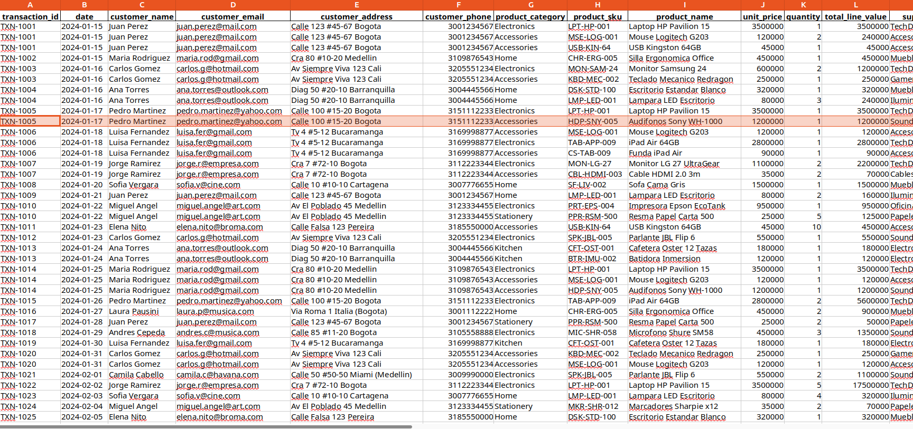
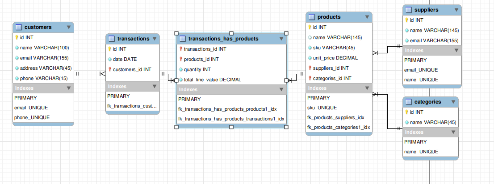

# ERD
## Reference
The ERD is based on the following example file:

## ERD (SQL normalized)

### entities explanation
#### customers
- Customers is a strong entity, it does not depend on any other entity
    - Succesfully complete 1FN (No repeated data)
    - Succesfully comlpete 2FN (1FN is done, does not have any unnescesary relatoinships)
    - Succesfully complete 3FN (2FN is done, does not have any transitional relationships)
    - Entity name is lowercase, all it's properties are lowercase
- `id` primary key, `name`, *unique* `email`, *unique* `phone`, `address`
    - email is unique as the customer must be contacted via email, and it does not make sense to have multiple customers with the same contact information
    - phone is unique for the same reasons as email.
    - address is not unique, as a customer can be living with other people, that can happen to be customers too
    - name is not unique, as multiple customers can share the same name (even last names)
#### suppliers
- Suppliers is a strong entity, it does not depend on any other entity
    - Succesfully complete 1FN (No repeated data)
    - Succesfully complete 2FN (1FN is done, does not have any unnecessary relationships)
    - Succesfully complete 3FN (2FN is done, does not have any transitional relationships)
- `id` primary key, *unique* `name`, *unique* `email`
    - name is unique, two suppliers don't share name in the assesment, and it real live, the name is a unique identifier for a supplier company, and must be like that to prevent confusion
    - email is unique, as this is contact information and must be unique to the supplier trying to be contacted
#### categories
- Categories is a strong entity, it does not depend on any other entity
    - Succesfully complete 1FN (No repeated data)
    - Succesfully comlpete 2FN (1FN is done, does not have any unnescesary relatoinships)
    - Succesfully complete 3FN (2FN is done, does not have any transitional relationships)
- `id` primary key, *unique* `name`
    - name is unique, the category name is a unique identifier for products categorization, there should not be more than one category with the same name
#### products
- Products is a weak entity, it depend on other entities (holds foreign keys)
    - Succesfully complete 1FN (No repeated data)
    - Succesfully comlpete 2FN (1FN is done, does not have any unnescesary relatoinships)
    - Succesfully complete 3FN (2FN is done, does not have any transitional relationships)
- `id` primary key, *unique* `sku`, `unit_price`, `name`, `suppliers_id` foreign key, `categories_id` foreign key
    - sku is unique, as it is a identifier for the register proccess, and must be unique to each product
    - unit_price is not unique, as multiple products can share the sane price
    - name is not unique, as multiple products can share name, but be different in price and/or supplier
    - suppliers_id is in a multiple to one relationships with products, as the assignment specifics show a given product only has a given supplier (In reality, there could be multiple, but for this particular activity a given product has a single supplier)
    - categories_id is in a multiple to one relationship with products, as a product can only be from one category at a time. (the categories are broad, and there are no subcategories that a product could have multiple of)
#### transactions
- Products is a weak entity, it depend on other entities (holds foreign keys)
    - Succesfully complete 1FN (No repeated data)
    - Succesfully comlpete 2FN (1FN is done, does not have any unnescesary relatoinships)
    - Succesfully complete 3FN (2FN is done, does not have any transitional relationships)
- `id` primary key, `date`, `customers_id` foreign key
    - id is an INT, different from the assignment id for transactions, as the prefix **TXN-** is not deemed necessary to mantain it's purporse, there are no other prefix on the given problem. 
    - date is not unique as multiple transactions can be made on a single date
    - customers_id is in a multiple to one relationship with transactions, as a given transaction holds only one customer, theere are no transactions with multiple customers.
#### transaction_has_product
- Transaction has products is the weakest entity, it completelly depends on other entities (it's primary key is composed from two foreign keys)
    - Succesfully complete 1FN (No repeated data)
    - Succesfully comlpete 2FN (1FN is done, does not have any unnescesary relatoinships)
    - Succesfully complete 3FN (2FN is done, does not have any transitional relationships)
- **composed primary key**, transactions_id *foreign key* + products_id *foreign_key*, `quantity`, `total_line_value`
    - Composed primary key only consists on transactions_id and products_id, as the supplier from the products is unnecesary, as a product has only a given supplier, with category is the same. The customer_id is not added as it has transactions_id, which has only one given customer.
    - quantity is an INT that represents the amount of the given product that is in the transaction
    - total_line_value is necessary, as the price from a product can change in time, a register from the revenue in the given transaction can be relaiabily used, without worying for using the wrong price (not the real price the product was sold at the given time)
### 
### ERD SQL Schema
- The schema name is "mydb", shortcut for mySQL database, if you want to change it, do so.
```sql
-- MySQL Script generated by MySQL Workbench
-- Mon Mar  2 16:02:33 2026
-- Model: New Model    Version: 1.0
-- MySQL Workbench Forward Engineering

SET @OLD_UNIQUE_CHECKS=@@UNIQUE_CHECKS, UNIQUE_CHECKS=0;
SET @OLD_FOREIGN_KEY_CHECKS=@@FOREIGN_KEY_CHECKS, FOREIGN_KEY_CHECKS=0;
SET @OLD_SQL_MODE=@@SQL_MODE, SQL_MODE='ONLY_FULL_GROUP_BY,STRICT_TRANS_TABLES,NO_ZERO_IN_DATE,NO_ZERO_DATE,ERROR_FOR_DIVISION_BY_ZERO,NO_ENGINE_SUBSTITUTION';

-- -----------------------------------------------------
-- Schema mydb
-- -----------------------------------------------------

-- -----------------------------------------------------
-- Schema mydb
-- -----------------------------------------------------
CREATE SCHEMA IF NOT EXISTS `mydb` DEFAULT CHARACTER SET utf8 ;
SHOW WARNINGS;
USE `mydb` ;

-- -----------------------------------------------------
-- Table `mydb`.`customers`
-- -----------------------------------------------------
DROP TABLE IF EXISTS `mydb`.`customers` ;

SHOW WARNINGS;
CREATE TABLE IF NOT EXISTS `mydb`.`customers` (
  `id` INT NOT NULL AUTO_INCREMENT,
  `name` VARCHAR(100) NOT NULL,
  `email` VARCHAR(155) NOT NULL,
  `address` VARCHAR(45) NOT NULL,
  `phone` VARCHAR(15) NOT NULL,
  PRIMARY KEY (`id`),
  UNIQUE INDEX `email_UNIQUE` (`email` ASC) VISIBLE,
  UNIQUE INDEX `phone_UNIQUE` (`phone` ASC) VISIBLE)
ENGINE = InnoDB;

SHOW WARNINGS;

-- -----------------------------------------------------
-- Table `mydb`.`transactions`
-- -----------------------------------------------------
DROP TABLE IF EXISTS `mydb`.`transactions` ;

SHOW WARNINGS;
CREATE TABLE IF NOT EXISTS `mydb`.`transactions` (
  `id` INT NOT NULL AUTO_INCREMENT,
  `date` DATE NOT NULL DEFAULT CURRENT_TIMESTAMP,
  `customers_id` INT NOT NULL,
  PRIMARY KEY (`id`, `customers_id`),
  INDEX `fk_transactions_customers1_idx` (`customers_id` ASC) VISIBLE,
  CONSTRAINT `fk_transactions_customers1`
    FOREIGN KEY (`customers_id`)
    REFERENCES `mydb`.`customers` (`id`)
    ON DELETE NO ACTION
    ON UPDATE NO ACTION)
ENGINE = InnoDB;

SHOW WARNINGS;

-- -----------------------------------------------------
-- Table `mydb`.`suppliers`
-- -----------------------------------------------------
DROP TABLE IF EXISTS `mydb`.`suppliers` ;

SHOW WARNINGS;
CREATE TABLE IF NOT EXISTS `mydb`.`suppliers` (
  `id` INT NOT NULL AUTO_INCREMENT,
  `name` VARCHAR(145) NOT NULL,
  `email` VARCHAR(155) NOT NULL,
  PRIMARY KEY (`id`),
  UNIQUE INDEX `email_UNIQUE` (`email` ASC) VISIBLE,
  UNIQUE INDEX `name_UNIQUE` (`name` ASC) VISIBLE)
ENGINE = InnoDB;

SHOW WARNINGS;

-- -----------------------------------------------------
-- Table `mydb`.`categories`
-- -----------------------------------------------------
DROP TABLE IF EXISTS `mydb`.`categories` ;

SHOW WARNINGS;
CREATE TABLE IF NOT EXISTS `mydb`.`categories` (
  `id` INT NOT NULL AUTO_INCREMENT,
  `name` VARCHAR(45) NOT NULL,
  PRIMARY KEY (`id`),
  UNIQUE INDEX `name_UNIQUE` (`name` ASC) VISIBLE)
ENGINE = InnoDB;

SHOW WARNINGS;

-- -----------------------------------------------------
-- Table `mydb`.`products`
-- -----------------------------------------------------
DROP TABLE IF EXISTS `mydb`.`products` ;

SHOW WARNINGS;
CREATE TABLE IF NOT EXISTS `mydb`.`products` (
  `id` INT NOT NULL AUTO_INCREMENT,
  `name` VARCHAR(145) NULL,
  `sku` VARCHAR(45) NOT NULL,
  `unit_price` DECIMAL NOT NULL,
  `suppliers_id` INT NOT NULL,
  `categories_id` INT NOT NULL,
  PRIMARY KEY (`id`, `suppliers_id`, `categories_id`),
  UNIQUE INDEX `sku_UNIQUE` (`sku` ASC) VISIBLE,
  INDEX `fk_products_suppliers_idx` (`suppliers_id` ASC) VISIBLE,
  INDEX `fk_products_categories1_idx` (`categories_id` ASC) VISIBLE,
  CONSTRAINT `fk_products_suppliers`
    FOREIGN KEY (`suppliers_id`)
    REFERENCES `mydb`.`suppliers` (`id`)
    ON DELETE NO ACTION
    ON UPDATE NO ACTION,
  CONSTRAINT `fk_products_categories1`
    FOREIGN KEY (`categories_id`)
    REFERENCES `mydb`.`categories` (`id`)
    ON DELETE NO ACTION
    ON UPDATE NO ACTION)
ENGINE = InnoDB;

SHOW WARNINGS;

-- -----------------------------------------------------
-- Table `mydb`.`transactions_has_products`
-- -----------------------------------------------------
DROP TABLE IF EXISTS `mydb`.`transactions_has_products` ;

SHOW WARNINGS;
CREATE TABLE IF NOT EXISTS `mydb`.`transactions_has_products` (
  `transactions_id` INT NOT NULL,
  `products_id` INT NOT NULL,
  `quantity` INT NOT NULL DEFAULT 1,
  `total_line_value` DECIMAL NOT NULL,
  PRIMARY KEY (`transactions_id`, `products_id`),
  INDEX `fk_transactions_has_products_products1_idx` (`products_id` ASC) VISIBLE,
  INDEX `fk_transactions_has_products_transactions1_idx` (`transactions_id` ASC) VISIBLE,
  CONSTRAINT `fk_transactions_has_products_transactions1`
    FOREIGN KEY (`transactions_id`)
    REFERENCES `mydb`.`transactions` (`id`)
    ON DELETE NO ACTION
    ON UPDATE NO ACTION,
  CONSTRAINT `fk_transactions_has_products_products1`
    FOREIGN KEY (`products_id`)
    REFERENCES `mydb`.`products` (`id`)
    ON DELETE NO ACTION
    ON UPDATE NO ACTION)
ENGINE = InnoDB;

SHOW WARNINGS;

SET SQL_MODE=@OLD_SQL_MODE;
SET FOREIGN_KEY_CHECKS=@OLD_FOREIGN_KEY_CHECKS;
SET UNIQUE_CHECKS=@OLD_UNIQUE_CHECKS;

```
> **Notice**: The sql schema code was created automatically form the ERD using mysql Workbench.
